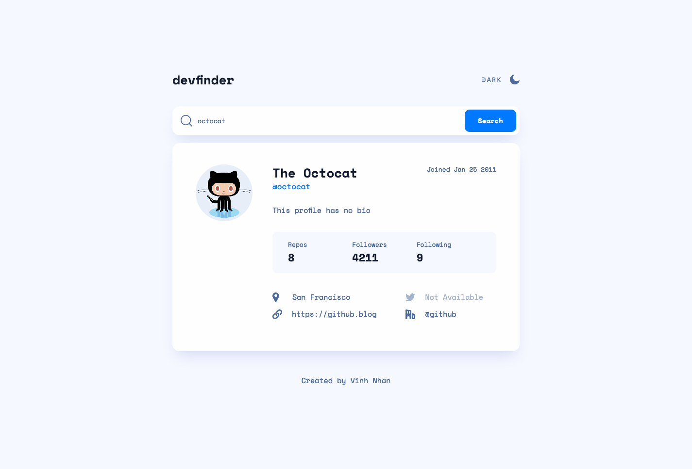
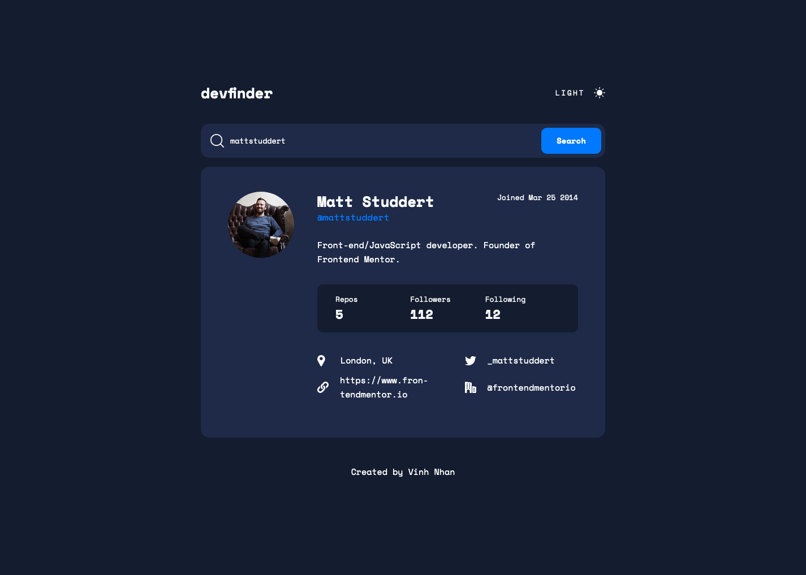
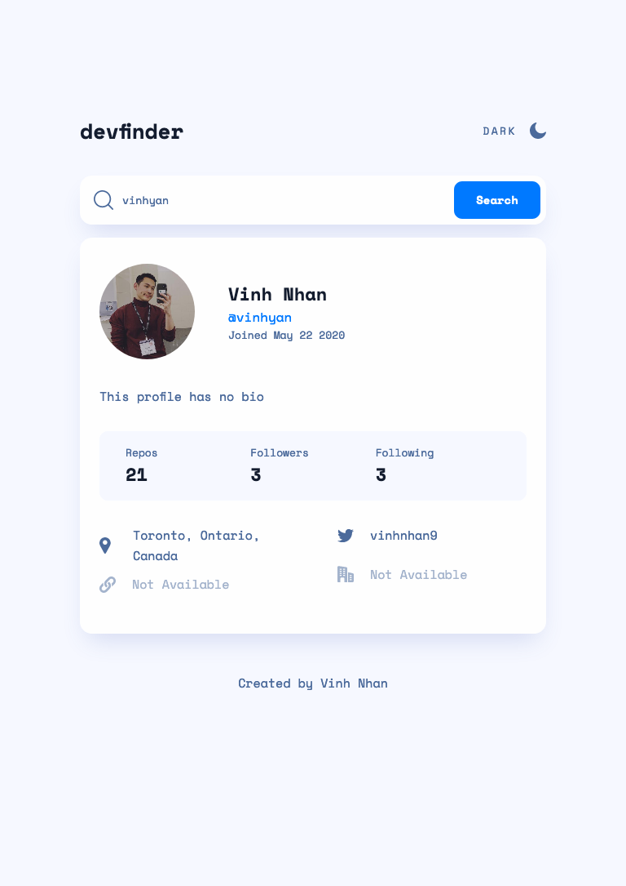
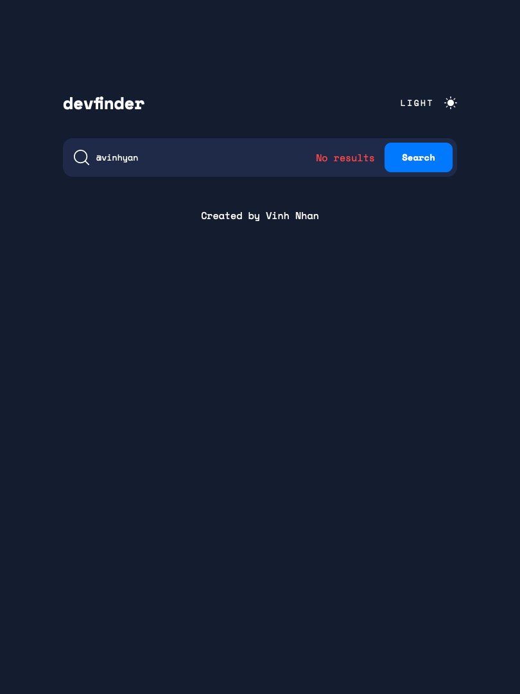
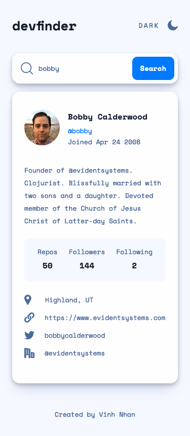
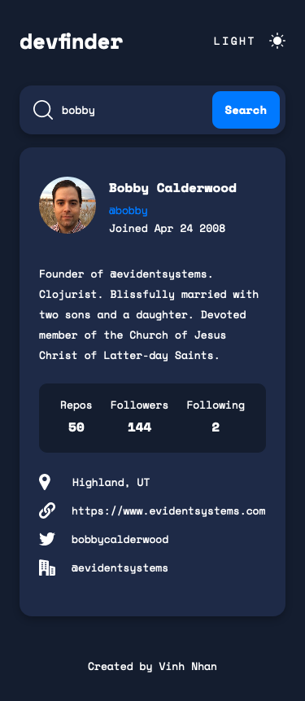

# Frontend Mentor - GitHub user search app solution

This is a solution to the [GitHub user search app challenge on Frontend Mentor](https://www.frontendmentor.io/challenges/github-user-search-app-Q09YOgaH6). Frontend Mentor challenges help you improve your coding skills by building realistic projects.

## Table of contents

- [Overview](#overview)
  - [The challenge](#the-challenge)
  - [Screenshot](#screenshot)
  - [Links](#links)
- [My process](#my-process)
  - [Built with](#built-with)
  - [What I learned](#what-i-learned)
  - [Useful resources](#useful-resources)
- [Author](#author)

## Overview

### The challenge

Users should be able to:

- View the optimal layout for the app depending on their device's screen size
- See hover states for all interactive elements on the page
- Search for GitHub users by their username
- See relevant user information based on their search
- Switch between light and dark themes

### Screenshot

#### Desktop

#### Tablet

#### Mobile

### Links

- Solution URL: [Solution](https://github.com/vinhyan/github-user-search-app.git)
- Live Site URL: [Live Site](vinhyan.github.io/github-user-search-app/)

## My process 

### Built with

- Semantic HTML5 markup
- CSS custom properties
- Flexbox
- CSS Grid
- Mobile-first workflow
- [React](https://reactjs.org/) - JS library
- [Redux](https://redux.js.org/) - JS library
- [Styled Components](https://styled-components.com/) - For styles

### What I learned

- Built app with mobile first workflow
- Use Redux in React app for state management
-  Enhance user experience by providing current state to the user when fetching data (`pending`, `fulfilled`, and `rejected`) 
- Use `ThemeProvider` from Styled Component to toggle Dark Mode

### Useful resources

- [CSS Tricks - Grid](https://css-tricks.com/snippets/css/complete-guide-grid/) - This helped me for the Grid layout used throughout the project
- [CSS Tricks - Flexbox](https://css-tricks.com/snippets/css/a-guide-to-flexbox/) - Always my go-to resource for Flexbox 
- [Dark Mode using Styled Component](https://create-react-app.dev/docs/deployment/) - An awesome 7:46 tutorial video by Will Code For Views which helped me set up Dark Mode for the project
- [React Deployment](https://create-react-app.dev/docs/deployment/) - How to deploy a React app

## Author

- [LinkedIn](https://www.linkedin.com/in/vinhnhan126/)
- [Twitter](https://twitter.com/vinhnhan9)
- [Frontend Mentor](https://www.frontendmentor.io/profile/vinhyan)
